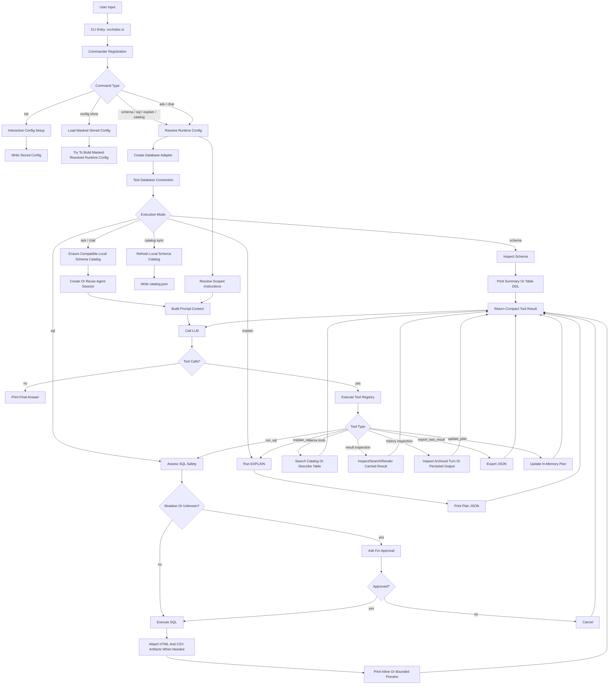
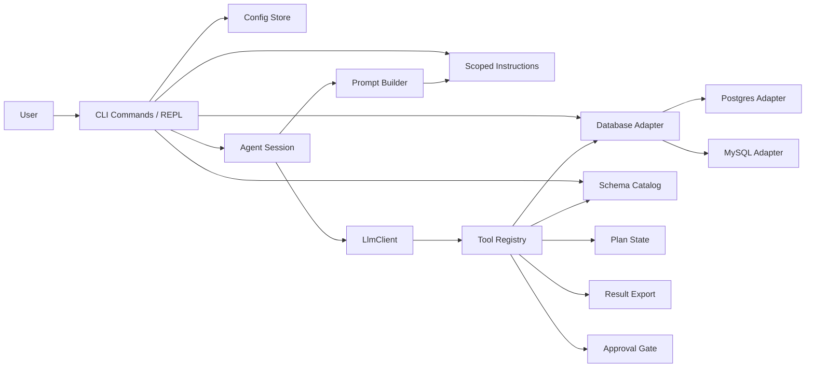
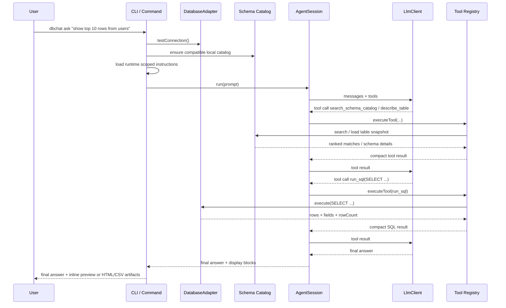
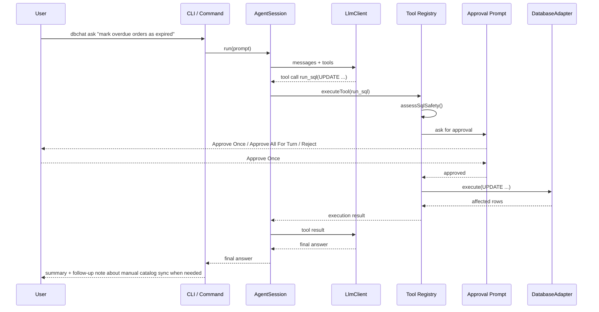
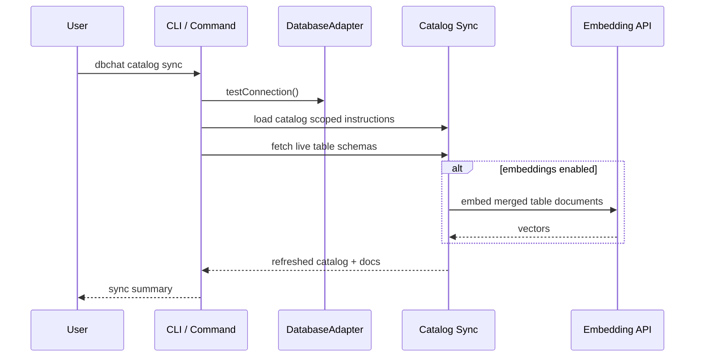
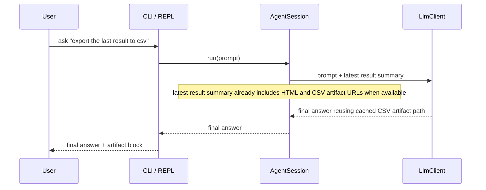

# dbchat-cli Architecture Diagrams

This document mirrors the current implementation.

## 1. Overall Flow

## 2. Runtime Layers

## 3. Read Query Sequence

## 4. Mutation Sequence

## 5. Catalog Sync Sequence

## 6. Result Artifact Reuse

