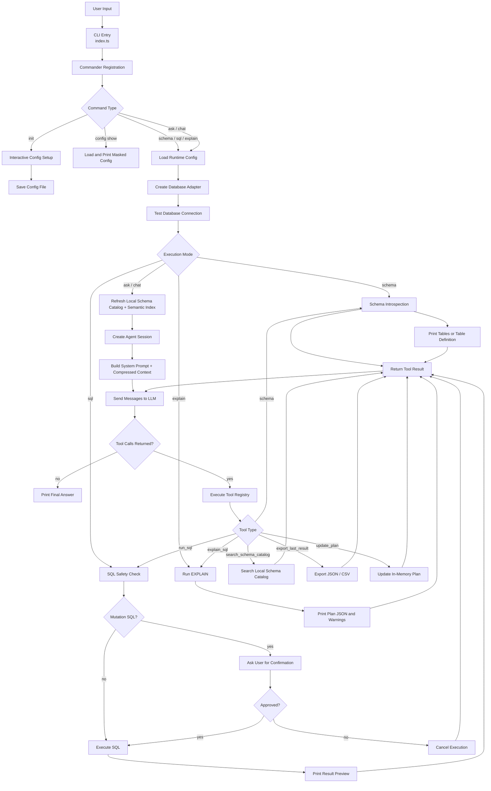
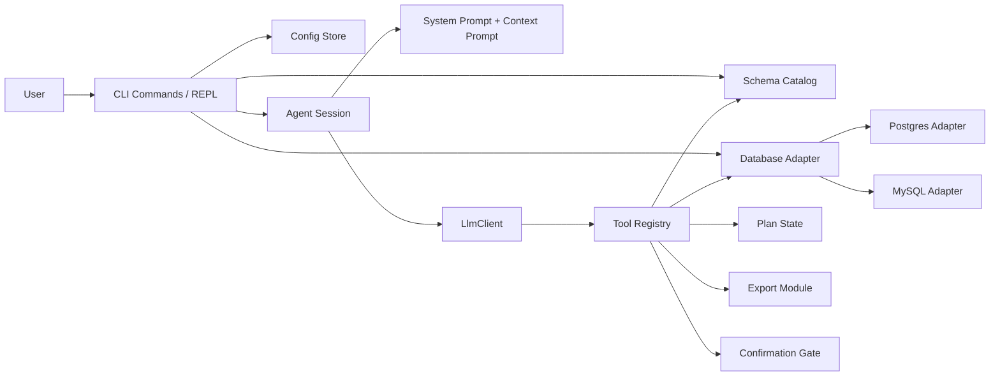
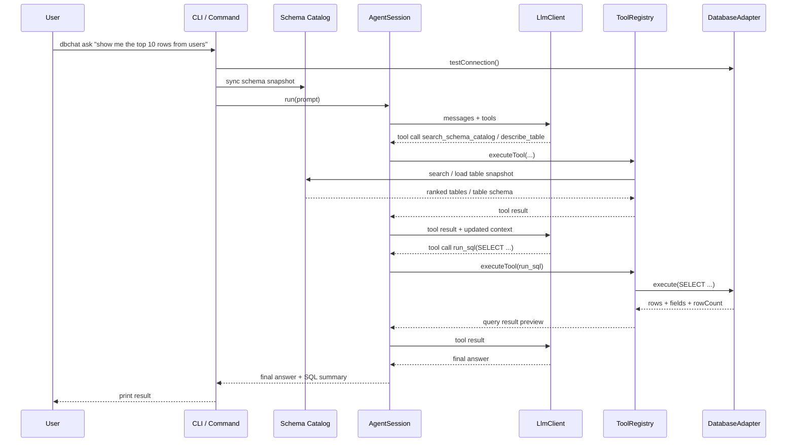
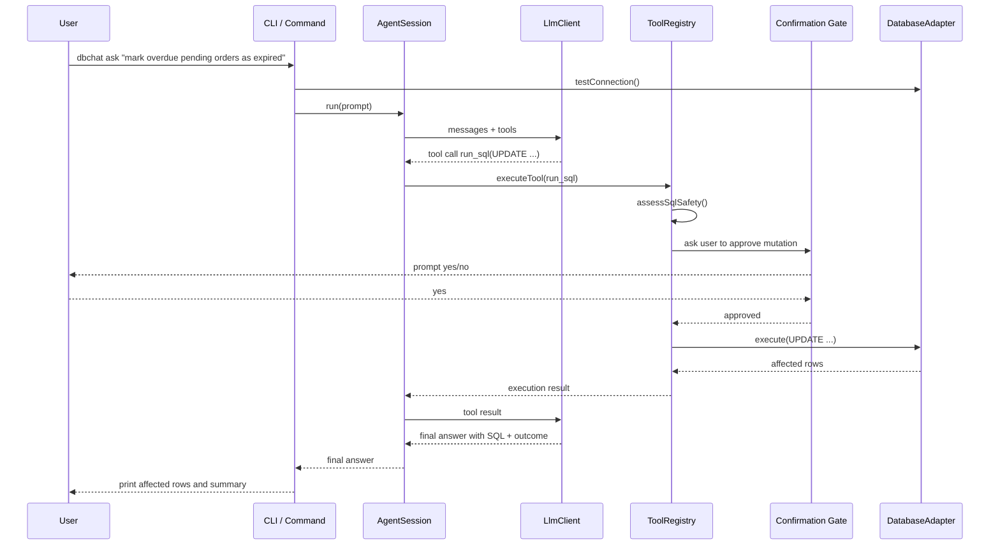
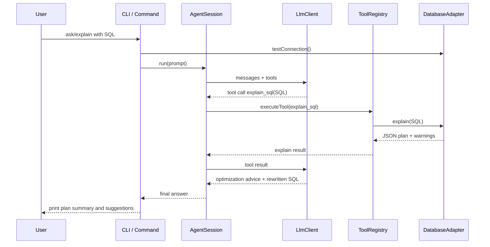
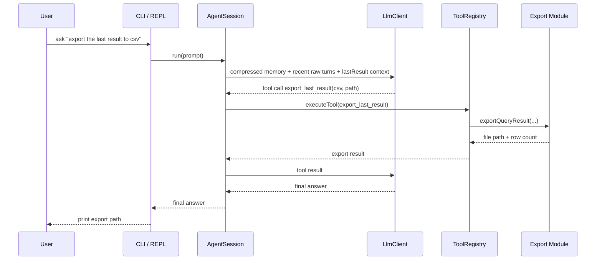
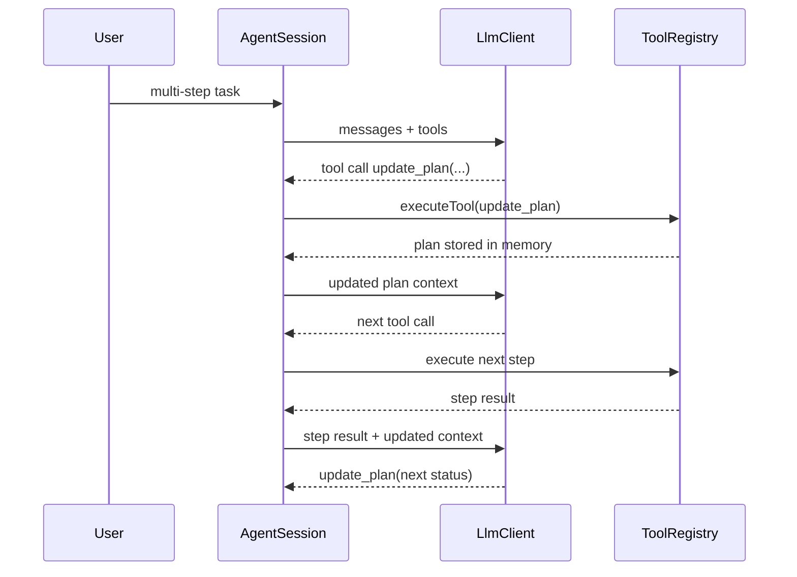

# db-chat-cli 架构图

本文使用流程图和时序图描述 `db-chat-cli` 的整体工作方式，覆盖：

- CLI 启动与命令分发
- 自然语言请求进入 agent loop
- LLM 与 tools 的交互
- 数据库查询 / 写操作确认 / explain / 导出

## 1. Overall Flowchart

## 2. Runtime Layer View

## 3. Sequence: Natural-Language Read Query

场景示例：

> show me the top 10 rows from users

## 4. Sequence: Natural-Language Mutation With Confirmation

场景示例：

> mark overdue pending orders as expired

如果用户拒绝确认，则流程在 `Confirmation Gate` 后直接返回 `cancelled`，不会执行数据库写操作。

## 5. Sequence: SQL Explain and Optimization

场景示例：

> analyze this SQL for performance and suggest improvements

## 6. Sequence: Export Last Query Result

场景示例：

> export the last result to csv

## 7. Complex Task With Plan

复杂任务会优先建立 plan，而不是直接执行所有动作。

## 8. How To Read These Diagrams

- `CLI / Command` 负责命令分发、结果打印、确认交互。
- `AgentSession` 负责维护 compressed memory、recent raw turns、plan、lastResult，并驱动最小 agent loop。
- `LlmClient` 负责对接 OpenAI-compatible 或 Anthropic-compatible API。
- `ToolRegistry` 是模型与外部能力之间的受控边界。
- `DatabaseAdapter` 屏蔽 PostgreSQL / MySQL 差异。
- `Confirmation Gate` 确保所有写操作都必须经过人工批准。

整体上，这个项目不是把数据库能力写死在流程图里，而是通过：

- 最小 agent loop
- tool-based execution
- explicit confirmation
- plan state
- adapter abstraction

来形成一个可控的数据库智能 CLI。
